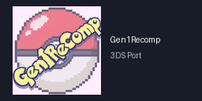

<p align="center">
  
</p>

<h1 align="center">Gen1Recomp · Lua Native 3DS Port</h1>

<p align="center">
  <b>Pokémon Red, Blue, Yellow, Gold, Silver and Crystal, recompiled in Lua, running natively on the Nintendo 3DS / 2DS.</b><br>
  No emulator. Your own cartridge dump, imported once on the PC. Installs as a 3dsx or as a real HOME-menu title.
</p>

<p align="center">
  <a href="https://github.com/cohako/gen1recomp-lua-native-3ds-port/releases/latest"></a>
  <a href="https://github.com/cohako/gen1recomp-lua-native-3ds-port/actions/workflows/tests.yml"></a>
  
  
  <a href="LICENSE"></a>
</p>

---

This is the 3DS port layer for [**gen1recomp**](https://github.com/bryanthaboi/gen1recomp), the LÖVE/Lua recreation of the Game Boy Pokémon games, built on a fork of [**LÖVE Potion**](https://github.com/lovebrew/lovepotion). Tested on a **New 2DS XL** with Luma3DS, both as a 3dsx (Homebrew Launcher) and as a CIA (HOME menu). Old 3DS/2DS is untested.

| | |
|---|---|
| 🎮 **Plays** | Gen 1 and Gen 2 through the upstream game, full speed battles, saves, sound effects and cries |
| 📦 **Installs** | `gen1recomp-<v>-3ds.zip` for the Homebrew Launcher, or `gen1recomp-<v>-3ds.cia` for a HOME-menu icon |
| 🖼️ **Renders** | PNG decoded straight into the PICA200's tiled layout, no `.t3x` pre-conversion needed |
| 🧰 **Ships** | Debug symbols and `sha256sums.txt` with every release |
| 🚫 **Contains** | Nothing from Nintendo: no ROMs, no firmware, no keys. Your cartridge, your dump. |

## ⚡ Quick start

**You need:** a 3DS/2DS with Luma3DS, the Homebrew Launcher (or FBI for the CIA), and one thing dumped from your own console:

> **`sdmc:/3ds/dspfirm.cdc`** — the DSP firmware, required by every homebrew that plays sound. Dump it once per SD card: Rosalina menu (**L + Down + Select**) → *Miscellaneous options* → *Dump DSP firmware*. It lands in the right place by itself. Without it the app exits before drawing anything.

<details open>
<summary><b>Option A — Homebrew Launcher (3dsx)</b></summary>

1. Download `gen1recomp-<version>-3ds.zip` from the [latest Release](https://github.com/cohako/gen1recomp-lua-native-3ds-port/releases/latest).
2. Extract it onto the **root of the SD card**, merging the `3ds` folder. You get `sdmc:/3ds/gen1recomp.3dsx` and `sdmc:/3ds/game/`.
3. Import your ROM on the PC (next section) and copy the version folder to `sdmc:/3ds/save/pokemon-love2d/`.
4. Open the Homebrew Launcher and start **Gen1Recomp**.

No card reader? Netload `ftpd.3dsx` once, then `scripts/3ds/ftp_upload_game.py <3DS-IP>` uploads the game tree over wifi.
</details>

<details>
<summary><b>Option B — HOME menu title (CIA, via FBI)</b></summary>

Same engine, as its own title: an icon on the HOME menu, no Homebrew Launcher, and about four times the heap the 3dsx gets under the launcher (91 MB measured vs ~24 MB).

1. Copy `gen1recomp-<version>-3ds.cia` anywhere on the SD card (or send it with FBI's *Remote Install* using `scripts/3ds/fbi_send_url.py <3DS-IP> <url>`).
2. FBI → *SD* → the `.cia` → **Install and delete CIA**.
3. You still need `sdmc:/3ds/game/` from the zip and your imported ROM folder: the CIA reads the same `3ds/game` and `3ds/save/pokemon-love2d` as the 3dsx, so both can live side by side.

The CIA holds only this repository's code plus LÖVE Potion, signed with makerom's public test keys, which is why a CFW is required. No Nintendo firmware, keys or assets inside.
</details>

## 💾 Importing your ROM (on the PC)

The console does not import ROMs (see [Limitations](#-current-limitations)). The PC does it in seconds. You need [LÖVE](https://love2d.org) installed, or the packaged desktop game via `LOVE_BIN`, and the assembled game tree (`tools/assemble.sh` → `work/game`, or an upstream checkout with the overlay applied):

```sh
cd work/game
scripts/3ds/import_rom.sh "Pokemon - Crystal Version (USA, Europe) (Rev A).gbc"
```

The script runs the game's importer headless (`POKEPORT_IMPORT_ONLY=1`) and copies the result out of LÖVE's save directory into `dist/3ds-sd/3ds/save/pokemon-love2d/<version>/`:

```
<version>/
  assets/generated/     PNG textures — the engine decodes PNG natively
  data/generated/
  rom-cache.complete    the marker the launcher checks; identical on every platform
```

Copy `dist/3ds-sd/3ds` onto the SD card root (merge). The launcher shows that version as ready — readiness *is* that marker; there is no flag or config on the console. Versions: `red`, `blue`, `yellow`, `gold`, `silver`, `crystal`; the ROM is identified by SHA-1, both Crystal revisions are accepted.

> The script has not been exercised end to end on the dev machine yet (no LÖVE installed there). The manual equivalent has: `POKEPORT_IMPORT_ONLY=1 POKEPORT_IMPORT_ROM=<rom> love .` in the game tree, then copy `~/.local/share/love/pokemon-love2d/<version>` (Linux; `%APPDATA%\LOVE\...` on Windows, `~/Library/Application Support/LOVE/...` on macOS).

<details>
<summary><b>🎵 Music (optional)</b></summary>

The console cannot synthesize the chip music in real time, so map and battle music is silent unless pre-rendered WAVs exist in the cache. Render them on the PC (needs LuaJIT; the script's header shows the Docker one-liner):

```sh
luajit scripts/3ds/prerender_music.lua <path/to/version-cache>
```

Output goes to `<version>/assets/generated/audio/music/*.wav`; copy it with the rest of the cache, or `scripts/3ds/ftp_upload_music.py <IP> --source <cache>`. Yellow's full set is ~76 MB.
</details>

## 🗂️ What is in this repository

This repository does **not** contain the game. It contains everything needed to build the port from the upstream game:

| Path | What |
|---|---|
| `engine/` | The LÖVE Potion fork (C++), full source. Rendering, audio, input and shutdown fixes for the 3DS, native PNG decode/encode, CIA start-up, the Gen1Recomp SMDH icon. |
| `overlay/` | New files added to the game: the 3DS platform layer (`src/core/Console.lua`), the console test suites, `scripts/3ds/`. |
| `patches/` | One diff per upstream game file the port edits (20 files). |
| `UPSTREAM` | The upstream gen1recomp commit the patches apply to. |
| `tools/` | `assemble.sh` (upstream + overlay + patches → `work/game/`), `package.sh` (release zip), `cia/` (RSF, banner, icon, `make_cia.sh`). |
| `docs/` | `instrumentation.md` + two patches: the console probes used during bring-up, removed from the build, re-applicable in one command. |

The `scripts/3ds/` tools live in `overlay/scripts/3ds/` here and inside the assembled game tree (`work/game/scripts/3ds/`); run them from the latter.

## 🔧 Building

Everything runs in Docker; no toolchain install needed.

```sh
# 1. game tree (clones upstream at the pinned commit, applies overlay + patches)
tools/assemble.sh                       # -> work/game

# 2. engine
docker run --rm -v "$PWD/engine":/src -w /src devkitpro/devkitarm:latest \
  sh -c 'cmake -G Ninja -S . -B build -Wno-dev -DCMAKE_TOOLCHAIN_FILE=/opt/devkitpro/cmake/3DS.cmake && ninja -C build'
  # -> engine/build/lovepotion.3dsx + lovepotion.elf

# 3. zip laid out like the SD root
tools/package.sh engine/build/lovepotion.3dsx 0.0.0-local

# 4. CIA (Linux x86_64 only: downloads pinned makerom + bannertool on first run)
tools/cia/make_cia.sh engine/build/lovepotion.elf dist/gen1recomp-0.0.1-3ds.cia v0.0.1
```

`UPSTREAM_DIR=/path/to/gen1recomp tools/assemble.sh` reuses a local clone. Console test suites (`overlay/tests/engine/*.lua`) run with `luajit` from `work/game`, same as CI.

**CI.** `tests.yml` runs on every push/PR to master (assemble + console test suites). `engine.yml` (3dsx + ELF + CIA artifacts) and `release.yml` are manual, from the Actions tab. `release.yml` picks the version (blank input = next patch after the newest tag), builds master, creates the tag and the GitHub Release, and attaches `gen1recomp-<v>-3ds.zip`, `gen1recomp-<v>-3ds.cia`, `gen1recomp-<v>-3ds-symbols.elf` and `sha256sums.txt`, with the issues closed and contributors since the previous release in the notes — the same shape as upstream's releases. It needs write access and refuses a version whose tag already exists.

<details>
<summary><b>Notes on the engine</b></summary>

- The game is loaded from `sdmc:/3ds/game/`, never from the 3DSX RomFS (that belongs to LÖVE Potion: shaders and the no-game screen). A CIA `chdir`s to `sdmc:/3ds` at start so both install methods share one layout.
- PNG loads natively: decoded straight into the PICA200's 8×8 tile layout; anything above 1024 px is box-filtered down to fit. A sibling `.t3x` (`tex3ds -f rgba8888 -z auto`) is still preferred when present.
- Fonts use the console's system font; `.ttf` files are not parsed.
- The SMDH title, author, description and icon are set in `engine/CMakeLists.txt` (`platform/ctr/icon-gen1recomp.png`, 48×48). The CIA's title version comes from the release tag.
</details>

<details>
<summary><b>Updating the upstream game</b></summary>

Edit the `game` line in `UPSTREAM`, run `tools/assemble.sh`. A patch that no longer applies is named in the output; regenerate it from a checkout with the change re-applied (`git diff <upstream> -- <file> > patches/NN-<file>.patch`). Run the tests, then verify on hardware.
</details>

## 🚧 Current limitations

- **No ROM import on the console.** Measured on a New 2DS XL under the Homebrew Launcher: a Gen 2 import took hours (one SD write and PNG encode per file) and then crashed in `malloc` at 68% — the extractor keeps ~30 MB live in Lua 5.1, more than the heap the 3dsx gets there. The Import button only tells you which folder to copy. The CIA has ~91 MB of heap, but import stays disabled on the console: the PC does it in seconds.
- **No map/battle music** without the pre-render step above. Sound effects, cries and Yellow's Pikachu voice work.
- **No online features on the console.** The mod index, mod downloads and the update check go through a `curl` subprocess or a native bridge on the other platforms; neither exists on the 3DS, so the Mods tab cannot fetch anything. (LÖVE Potion does ship `https`; wiring it in is future work.)
- **Top screen only** (400×240). The bottom screen is unused.
- Tilt effect disabled (its 741×573 canvas does not fit VRAM). Palette effects run without shaders.
- The New 3DS C-stick is not read (the engine never initialises `irrst`). D-pad, Circle Pad, buttons and touch work.
- Performance: the GPU is mostly idle; frame time is interpreted Lua on the main core. Battle/encounter transitions are noticeably slow.
- Memory: the CIA gets 91 MB of heap + 32 MB linear (measured). Under the Homebrew Launcher the split is inherited from the host title, roughly 24 MB + 32 MB by libctru's defaults (not measured). VRAM is 6 MB either way.
- Azahar/Citra cannot be used to test: LÖVE Potion exits immediately under it (lovebrew/LovePotion#102) while the same build runs on hardware.
- Upstream pinned to `fdd1d61e` (dev, 2026-09-05). Newer upstream releases need the patches refreshed.
- Tested on a New 2DS XL only. The CIA asks for the New 3DS memory mode (`SystemModeExt: 124MB`); an Old 3DS/2DS is untested.

## 🔍 Debugging on hardware

- Lua errors: `sdmc:/3ds/save/pokemon-love2d/lua-error.log`.
- Engine start-up failures (a system service, the boot, the no-game screen): `sdmc:/gen1_init.txt` and `sdmc:/gen1_boot_error.txt`. These are the only probes left in the build; the per-frame traces used during bring-up are in `docs/instrumentation.md`, with patches to put them back.
- Native crashes: Luma writes `sdmc:/luma/dumps/arm11/crash_dump_*.dmp`. Read `pc`/`lr` from the register dump and resolve them against the release's `gen1recomp-<version>-3ds-symbols.elf`: `arm-none-eabi-addr2line -f -C -e gen1recomp-<version>-3ds-symbols.elf <pc> <lr>`.
- `3dslink` does not stream stdout back; read errors from the files above.
- Files on the SD are easiest to pull over wifi: netload `ftpd.3dsx`, then `scripts/3ds/mirror_sd.py <3DS-IP>`.

## 📜 License

This repository (patches, overlay, tools, engine changes) is MIT, see [`LICENSE`](LICENSE). gen1recomp is © BOIS CLUB GAMES, LLC, MIT. LÖVE Potion is © Serena S. Postelnek & Logan Hickok-Dickson, MIT ([`engine/LICENSE.md`](engine/LICENSE.md)). No Nintendo or Game Freak assets, ROMs or firmware are included — bring your own cartridge.
